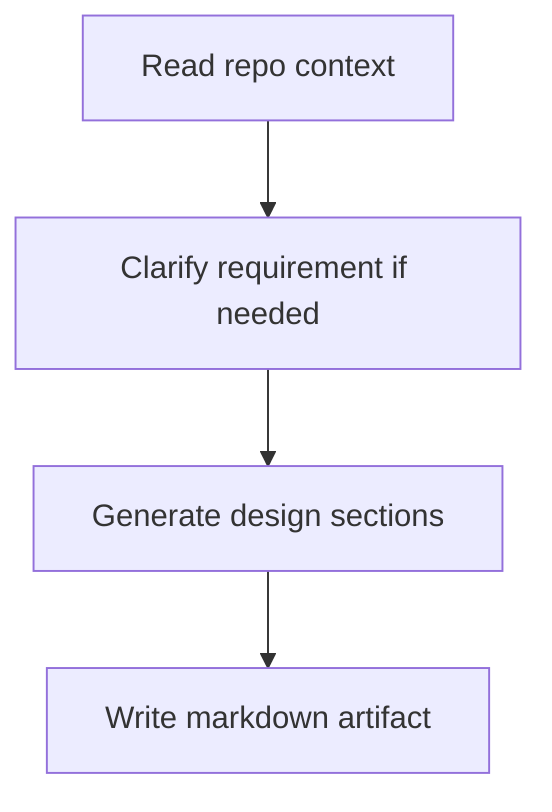

# Engineering Design Agent Overview

## What This Agent Does
This agent generates repo-aware engineering design artifacts such as BDD stories, HLD, LLD, test data, and Mermaid diagrams from a feature brief, including `feature.txt` input.
It accepts an optional `storyCount` for BDD generation, asks for the number of stories when that detail is missing, and uses 5 subtasks per story by default.

## When To Use It
- Use it for feature-design breakdowns.
- Use it when requirements need to become structured engineering documentation.

## When Not To Use It
- Do not use it for code fixes.
- Do not use it when the requirement is too vague to support meaningful artifacts without clarification.

## How It Works
It reads repository context, interprets the requirement, generates the requested artifact set, and writes the result under `docs/generated/`.
HLD and LLD sections include Mermaid diagrams as part of the generated output.

## Request / Prompt / Output

| Request | Prompt | Output |
| --- | --- | --- |
| BDD only | `Generate BDD stories for this feature. If storyCount is missing, ask how many stories should be created before continuing.` | Markdown design artifact with epics, user stories, 5 subtasks per story by default, BDD scenarios, test data, tasks, dependencies, execution plan, risks, NFRs, and estimation summary |
| Architecture only | `Generate the architecture design for this feature.` | Markdown design artifact with architecture overview, HLD, LLD, Mermaid diagrams, component responsibilities, and data model |
| Full design | `Generate a full design document with BDD and architecture sections.` | Markdown design artifact with combined BDD and architecture sections, Mermaid diagrams wherever they help, test data, scenario coverage, risks, NFRs, and estimation summary |
| Template | `Generate a reusable design template for this feature.` | Markdown template with placeholders for future feature work and Mermaid examples where useful |
| Broad requirement | `Here is the feature context, but the scope is broad.` | A clarifying question for the target screen, feature, or design scope |
| Missing repo context | `I need the repository details to align the design.` | A bounded response that explains the missing context and what is needed next |

## Repo Context It Reads
- `README.md`
- build files
- relevant source files
- relevant config files

## Always Included
- saved markdown path
- generated section list
- assumptions

## Tools It Uses
- `codebase`: reads repository context
- `file_operations`: writes the output markdown file

## How To Prompt It
Provide the requirement and state whether you want BDD stories, architecture design, a full design document, or a template. Include `storyCount` if you already know how many stories should be created; otherwise the agent asks for the missing count before BDD generation continues.

## Example Prompts
- `Using `feature.txt`, generate a full design report.`
- `Using `feature.txt`, generate BDD stories and ask me for storyCount if it is missing.`
- `Using `feature.txt`, generate only the architecture section of the report.`
- `Using `feature.txt`, generate a reusable report template.`
- `Using `feature.txt` and `storyCount=5`, generate the BDD report.`
- `Using `feature.txt`, generate a report with HLD, LLD, Mermaid diagrams, and risks.`
- `Using `feature.txt`, generate the report in markdown and save it under docs/generated/.`
- `Using the feature description in `feature.txt`, generate a full design document with BDD and architecture sections.`

## Limits And Guardrails
- It should not invent repository context.
- It should make assumptions explicit when requirements are incomplete.
