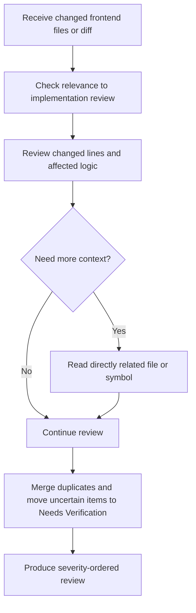

# Frontend Code Review Agent Overview

## What This Agent Does
This agent reviews React, JavaScript, and TypeScript implementation changes for evidence-backed issues in correctness, security, reliability, performance, dead code, maintainability, and dependency risk.

It is designed for regular pull request review where findings need file and line references, practical fixes, proportional severity, and clear separation between confirmed issues and items that need runtime verification.

## When To Use It
- Use it for changed React components, hooks, pages, utilities, API integration code, or TypeScript implementation files.
- Use it when reviewing React logic, JavaScript or TypeScript behavior, state flow, async behavior, API handling, security, performance, or maintainability.
- Use it when static review can identify implementation risks before lint, typecheck, build, test, or runtime validation.

## When Not To Use It
- Do not use it for HTML semantics, W3C validity, ARIA, WCAG, keyboard navigation, CSS, responsive layout, browser rendering behavior, SEO metadata, or UI/component testing gaps.
- Do not use it to claim runtime, test, build, browser, or accessibility behavior was verified unless those checks were actually run.
- Do not use it to generate findings for every category when the code does not support them.
- Do not use it for unrelated legacy code review unless the submitted change introduces or worsens the issue.

## How It Works
The agent starts with the changed files, filters for implementation-review relevance, reviews changed lines and directly affected code, reads only the related file, symbol, type, hook, API wrapper, test, or configuration needed to validate a finding, and returns a severity-ordered markdown review.

## Inputs It Expects
- frontend source files, changed files, or pull request diff
- optional repository scope such as changed files, component, page, or package
- optional framework context such as React, Next.js, Vue, Angular, or vanilla JavaScript
- optional focus areas such as React, TypeScript, security, performance, error handling, dependencies, or maintainability
- optional project validation commands for linting, type checking, testing, or builds

## Outputs It Produces
- markdown review with confirmed findings in the required finding format
- severity, category, file, line or line range, issue, impact, suggested fix, and confidence for every confirmed finding
- `Needs Verification` section for important risks that static review cannot prove
- final `Review Summary` severity count table
- explicit no-issues statement when no actionable issues are identified

## Tools It Uses
- `codebase`: reads changed files, nearby implementation usage, types, hooks, API wrappers, tests, and configuration when needed

## How To Prompt It
Provide the implementation files, diff, component, page, or PR scope you want reviewed. Mention any specific concerns, such as hooks, stale closures, async error handling, state bugs, security, duplicate API calls, render performance, dead code, dependency misuse, or maintainability.

## Example Prompts
- `@frontend-code-review review the changed React files for correctness, security, and error handling`
- `@frontend-code-review inspect this hook for stale closures, effect dependencies, cleanup, and race conditions`
- `@frontend-code-review review these TypeScript changes for null handling, unsafe casts, and promise failures`
- `@frontend-code-review check this component for unnecessary re-renders, expensive render work, and justified memoization`
- `@frontend-code-review review this frontend diff for dead code, dependency misuse, and maintainability risks`

## Limits And Guardrails
- It should review changed files first and avoid whole-repository scans unless absolutely necessary.
- It should read surrounding files only when required to validate a finding.
- It should ground every confirmed finding in visible code evidence.
- It should avoid preference-only feedback and broad rewrites when a focused fix is enough.
- It should not claim validation commands passed unless they were actually executed successfully.
- It should not invent security vulnerabilities or dependency CVEs without scanner or authoritative evidence.
- It should move uncertain static-analysis concerns into `Needs Verification`.
- It should keep severity proportional to realistic user and production impact.
