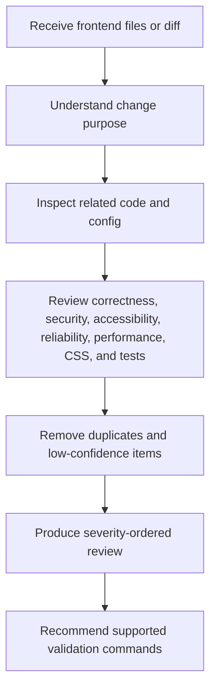

# Frontend Code Review Agent Overview

## What This Agent Does
This agent reviews frontend code changes for evidence-backed issues across correctness, security, accessibility, reliability, performance, maintainability, standards, and tests.

It is designed for React, JavaScript, TypeScript, HTML, and CSS review work where findings need file and line references, practical fixes, and clear severity.

## When To Use It
- Use it for frontend pull request reviews.
- Use it for changed React components, hooks, pages, styles, or tests.
- Use it when accessibility, security, performance, and test coverage should be reviewed together.
- Use it when you need a concise report that separates confirmed findings from items that need runtime verification.

## When Not To Use It
- Do not use it for broad visual design critique without code-level evidence.
- Do not use it to claim browser, device, screen-reader, or runtime behavior was verified unless those checks were actually run.
- Do not use it to generate findings for every category when the code does not support them.
- Do not use it for unrelated legacy code review unless the submitted change introduces or worsens the issue.

## How It Works
The agent inspects the supplied frontend scope, reads directly related code and project configuration when needed, checks high-impact frontend risk areas, removes duplicate or low-confidence findings, and returns a severity-ordered markdown review.

## Inputs It Expects
- frontend source files, changed files, or pull request diff
- optional repository scope such as component, page, package, or repo
- optional framework context such as React, Next.js, Vue, Angular, or vanilla JavaScript
- optional focus areas such as accessibility, security, React, TypeScript, performance, CSS, responsive behavior, testing, or SEO
- optional project validation commands for linting, type checking, testing, accessibility checks, or builds

## Outputs It Produces
- markdown report beginning with `# Frontend Code Review`
- summary of files reviewed and main risk areas
- severity-ordered findings with category, file, line, issue, impact, suggested fix, and confidence
- `Needs Verification` section for important risks that static review cannot prove
- final severity count table
- recommended validation commands supported by the repository

## Tools It Uses
- `codebase`: reads source files, nearby usage, tests, and configuration

## How To Prompt It
Provide the files, diff, component, page, or repository scope you want reviewed. Mention any specific concerns, such as accessibility, async error handling, performance, responsive CSS, or tests.

## Example Prompts
- `@frontend-code-review review the changed React files in this pull request for correctness, accessibility, security, and test gaps`
- `@frontend-code-review inspect this component and report only evidence-backed issues with file and line references`
- `@frontend-code-review review these TypeScript UI changes and focus on async error handling, state bugs, and accessibility`
- `@frontend-code-review check this Next.js page for semantic HTML, metadata, responsive layout, and performance risks`
- `@frontend-code-review review the frontend diff and recommend validation commands supported by this repository`

## Limits And Guardrails
- It should ground every confirmed finding in visible code evidence.
- It should avoid preference-only feedback and broad rewrites when a focused fix is enough.
- It should not claim validation commands passed unless they were actually executed successfully.
- It should not invent security vulnerabilities or dependency CVEs without scanner or authoritative evidence.
- It should move uncertain static-analysis concerns into `Needs Verification`.
- It should keep severity proportional to realistic user and production impact.
