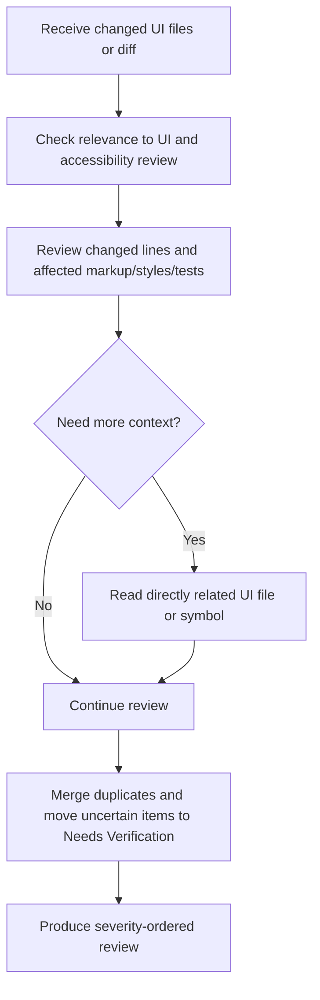

# Frontend UI Accessibility Review Agent Overview

## What This Agent Does
This agent reviews user-facing frontend changes for evidence-backed issues in HTML standards, semantic markup, accessibility, CSS, responsive behavior, browser compatibility, SEO, and UI testing.

It is designed for regular pull request review where findings need file and line references, practical fixes, proportional severity, and clear separation between confirmed issues and items that need browser or assistive-technology verification.

## When To Use It
- Use it for changed pages, components, templates, styles, and UI tests.
- Use it when reviewing markup, forms, ARIA, keyboard behavior, focus management, dialogs, modals, responsive layout, browser support, metadata, or UI test coverage.
- Use it when static review can identify user-facing accessibility or UI risks before runtime validation.

## When Not To Use It
- Do not use it for React state flow, hooks correctness, JavaScript or TypeScript runtime logic, API error handling, XSS ownership, unnecessary re-renders, dead implementation code, broad maintainability, or dependency misuse.
- Do not use it to claim browser, device, screen-reader, accessibility-tool, visual, test, or build behavior was verified unless those checks were actually run.
- Do not use it for broad visual design critique without code-level evidence.
- Do not use it to generate findings for every category when the code does not support them.
- Do not use it for unrelated legacy code review unless the submitted change introduces or worsens the issue.

## How It Works
The agent starts with the changed files, filters for user-facing UI relevance, reviews changed lines and directly affected UI code, reads only the related component, stylesheet, route metadata, test, shared UI primitive, or configuration needed to validate a finding, and returns a severity-ordered markdown review.

## Inputs It Expects
- user-facing frontend source files, changed files, or pull request diff
- optional repository scope such as changed files, component, page, or package
- optional framework context such as React, Next.js, Vue, Angular, or vanilla JavaScript
- optional focus areas such as HTML, accessibility, WCAG, ARIA, CSS, responsive behavior, browser compatibility, SEO, or UI testing
- optional project validation commands for linting, accessibility checks, visual review, component tests, end-to-end tests, or builds

## Outputs It Produces
- markdown review with confirmed findings in the required finding format
- severity, category, file, line or line range, issue, impact, suggested fix, and confidence for every confirmed finding
- `Needs Verification` section for important risks that static review cannot prove
- final `Review Summary` severity count table
- explicit no-issues statement when no actionable issues are identified

## Tools It Uses
- `codebase`: reads changed files, nearby UI usage, shared UI primitives, stylesheets, tests, route metadata, and configuration when needed

## How To Prompt It
Provide the UI files, diff, component, page, or PR scope you want reviewed. Mention any specific concerns, such as WCAG, ARIA, keyboard support, form labeling, modal focus management, responsive layout, CSS conflicts, browser compatibility, SEO metadata, or UI test coverage.

## Example Prompts
- `@frontend-ui-accessibility-review review the changed UI files for accessibility, semantic HTML, and responsive layout issues`
- `@frontend-ui-accessibility-review inspect this component for keyboard navigation, ARIA, labels, and focus management`
- `@frontend-ui-accessibility-review check this Next.js page for heading hierarchy, metadata, alt text, and canonical/indexing concerns`
- `@frontend-ui-accessibility-review review these CSS changes for overflow, fixed-dimension layout risk, specificity, and conflicting styles`
- `@frontend-ui-accessibility-review review the changed component tests for user interactions and accessibility-sensitive behavior`

## Limits And Guardrails
- It should review changed files first and avoid whole-repository scans unless absolutely necessary.
- It should read surrounding files only when required to validate a finding.
- It should ground every confirmed finding in visible code evidence.
- It should avoid preference-only design feedback and broad rewrites when a focused fix is enough.
- It should not claim validation commands passed unless they were actually executed successfully.
- It should not claim exact contrast ratios, screen-reader output, or rendered browser behavior from static source review alone.
- It should move uncertain static-analysis concerns into `Needs Verification`.
- It should keep severity proportional to realistic user and production impact.
