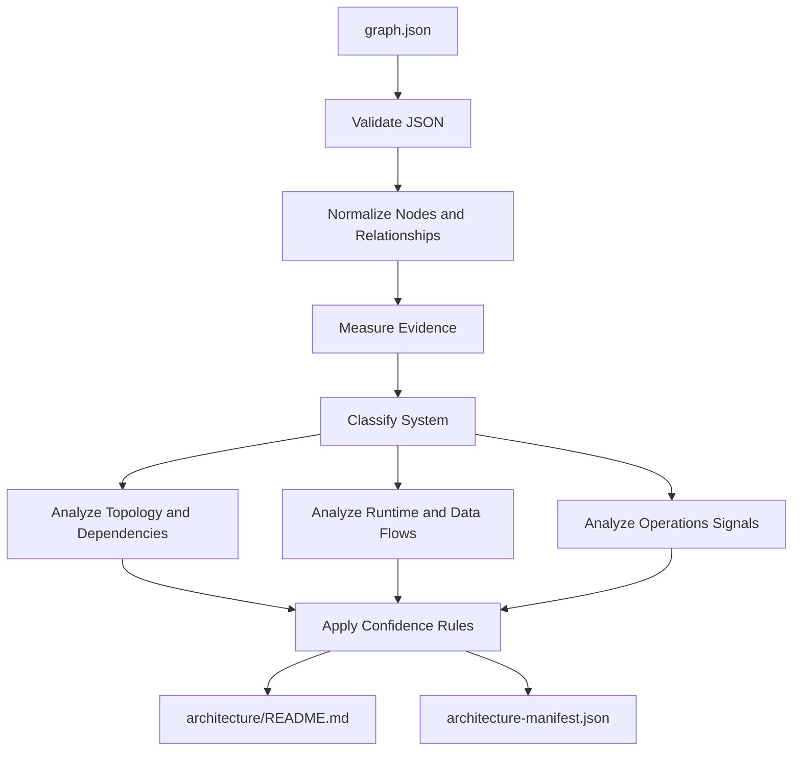

# Graphify Fullstack Project Architecture Orchestrator Overview

## What This Agent Does

This agent creates an architecture package exclusively from `graphify-out/graph.json`. It does not inspect source code, supporting Graphify reports, repository metadata, or existing architecture documents.

## Input

- Default graph: `graphify-out/graph.json`
- Optional custom graph path inside the project root

## Output

```text
architecture/
|-- README.md
`-- architecture-manifest.json
```

## Analysis Flow



## Evidence Rules

- Extracted relationships are documented as observed graph evidence.
- Inferred relationships remain explicitly labeled as inferred.
- Ambiguous relationships are treated as limitations or risks.
- Missing facts remain `Not established by Graphify evidence`.

## Example Prompts

- `Generate architecture using only graphify-out/graph.json.`
- `Create backend architecture from the Graphify graph only.`
- `Use services/graphify-out/graph.json and write architecture to docs/architecture.`

## Guardrails

- The agent does not read source files or other repository content.
- The agent does not generate, update, or modify Graphify output.
- The agent preserves unrelated files in the output directory.
- Every documented relationship and diagram edge must exist in the graph.
