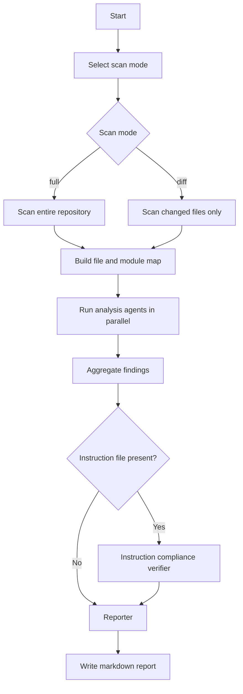

# Ultimate Codebase Analysis Agent - Overview

## Overview

This agent orchestrates large-codebase analysis by splitting work across specialized internal agents and consolidating the results into a single markdown report.

It is designed for:
- full repository review
- git diff review
- Java and Spring backend analysis
- dependency review
- exception and runtime-risk review
- instruction compliance verification

## Supported Workflow

1. Scan the repository and build a module/file map.
2. Run analysis agents in parallel.
3. Verify compliance against instruction-based rules.
4. Generate one final markdown report.

## Architecture Overview

The architecture is optimized for large repositories by:
- chunking by module
- using a minimum of 6 agents and a maximum of 9 agents
- limiting work per agent
- using parallel execution for independent analysis
- aggregating outputs into a single reporter stage

## Agents and Responsibilities

- Scanner: discover repository structure and prepare analysis scope
- Static Analyzer: detect defects, anti-patterns, and performance issues
- Exception Analyzer: review exception handling quality and runtime failure modes
- Dependency Analyzer: review build and dependency health
- Performance Analyzer: review hot paths, allocation pressure, database access, caching behavior, and concurrency bottlenecks
- Instruction Compliance Verifier: enforce rules from the instruction source
- Reporter: generate the final executive report

## Agent Count Rule

- Minimum agents: 6
- Maximum agents: 9
- Keep the core scanner, analyzers, compliance verifier, and reporter in place
- Add optional specialist agents only when the review scope justifies them
- Select `full` or `diff` scan mode before scanning begins
- Run static, exception, dependency, and performance analysis in parallel when relevant

## How To Use

- `@ultimate-codebase-analysis-agent`
- `@ultimate-codebase-analysis-agent scanMode=full`
- `@ultimate-codebase-analysis-agent scanMode=diff`
- `@ultimate-codebase-analysis-agent static-analysis`
- `@ultimate-codebase-analysis-agent exception-analysis`
- `@ultimate-codebase-analysis-agent dependency-check`
- `@ultimate-codebase-analysis-agent performance-analysis`
- `@ultimate-codebase-analysis-agent summarize critical issues`
- `@ultimate-codebase-analysis-agent scan module portal`

## Output

The final report is written as `codebase-analysis-report.md` and includes:
- Summary
- Critical Issues
- High Issues
- Medium Issues
- Low Issues
- Exception Highlights
- Dependency Risks
- Performance Highlights
- Compliance Summary
- Compliance Violations
- Recommendations

## Best Practice

Use full scan for baseline audits, architecture reviews, compliance reviews, and release readiness checks. Use diff scan for pull requests, targeted validation, or fast feedback on recent edits. Keep compliance verification enabled for every run that has an instruction source.

## Guardrails

- Do not invent files or modules that are not present.
- Do not treat assumptions as findings.
- Do not merge unrelated issues into one category.
- Do not emit vague recommendations without code evidence.
- Do not skip compliance verification when the instruction set is available.
- Do not degrade output quality for large repositories; chunk instead.
