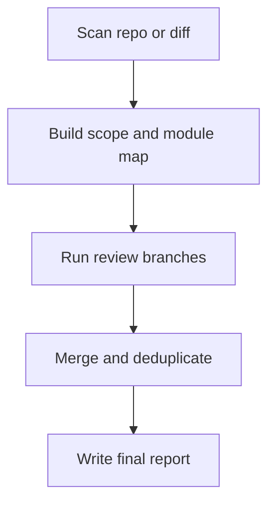

# Ultimate Codebase Analysis Agent Overview

## What This Agent Does
This agent performs broad codebase analysis across multiple concern areas and consolidates the result into one actionable report.

## When To Use It
- Use it for repository-wide or diff-wide assessments.
- Use it when you need one combined report across runtime risk, dependencies, performance, and compliance.

## When Not To Use It
- Do not use it for narrow single-file analysis.
- Do not use it when a specialist agent would be simpler and more precise.

## How It Works
It scans the repository, chunks scope when needed, runs scoped review branches, then merges the findings into one consolidated result.

## Inputs It Expects
- repository root
- optional diff scope
- optional instruction source

## Outputs It Produces
- JSON summary of scope, findings, and recommendations
- consolidated markdown report path

## Tools It Uses
- `codebase`: reads repository contents
- `file_operations`: writes the report artifact

## How To Prompt It
Give it the repository scope and say whether you want a full scan or diff scan. Mention focus areas if you want a weighted review.

## Example Prompts
- `Run a full codebase review and produce one report.`
- `Analyze this diff for runtime and dependency risk.`

## Limits And Guardrails
- It should not invent sub-analysis findings.
- It should keep compliance separate from general code quality.
