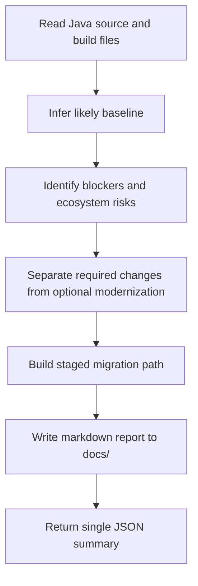

# Java 21 Upgrade Recommender Skill Overview

## What This Skill Does
This skill reviews Java source and build configuration, infers the likely current baseline, identifies migration blockers, and recommends a practical path to Java 21. It also writes a markdown report under `docs/` and returns a final JSON summary.

## When To Use It
- Use it for Java runtime and language modernization reviews.
- Use it when the project may still target Java 5, Java 8, Java 11 to 17, or a mixed baseline.
- Use it when you want staged upgrade advice before making code changes.

## When Not To Use It
- Do not use it as a build executor or refactoring engine.
- Do not use it to assert Java 21 compatibility without code, build, and dependency evidence.

## Inputs It Expects
- Java source files
- Maven or Gradle build files when available
- optional `analysisScope`
- optional `currentJavaVersion`
- optional `focusAreas`
- optional `targetJavaVersion`

## How It Works

## Outputs It Produces
- markdown report path under `docs/`
- inferred baseline with evidence
- prioritized issues and recommendations
- migration plan
- manual checks
- risk summary
- final JSON object

## Report Shape
The markdown report should cover:

- title
- analyzed scope
- detected baseline and evidence
- executive summary
- migration risk summary
- prioritized findings
- recommended migration path
- optional Java 21 modernization opportunities
- manual checks
- conclusion

## Classification Model
Use these labels where they help triage:

- `compatibility_blocker`
- `required_migration_change`
- `optional_modernization`
- `preview_only`

## Guardrails
- Do not modify source files.
- Do not recommend preview features as default upgrade work.
- Do not hide uncertainty when build and source evidence disagree.
- Do not collapse dependency and runtime risk into source-only findings.

